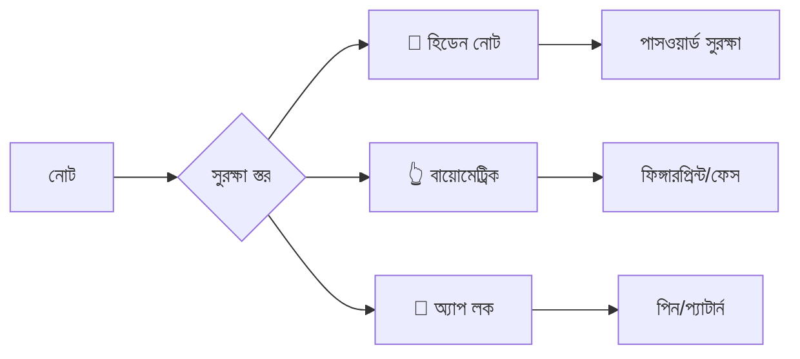
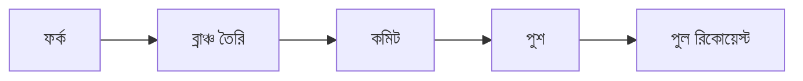

<div align="center">
  
  
  # 📖 কাব্যলোকের ব্রক্ষকবি
  ### *Kabboloker Brakkhakbi — The Poet's Notebook*
  
  <p>
    <b>একটি আধুনিক, নমনীয় ও দৃষ্টিনন্দন বাংলা নোটপ্যাড ও সাহিত্য লিখন অ্যান্ড্রয়েড অ্যাপ্লিকেশন</b>
  </p>
  
  <br>
  
  <a href="https://github.com/Tasibtohs/kabboloker-brakkhakbi_V1.0.3/releases/latest">
    
  </a>
  <a href="https://github.com/Tasibtohs/kabboloker-brakkhakbi_V1.0.3/blob/main/LICENSE">
    
  </a>
  <a href="https://github.com/Tasibtohs/kabboloker-brakkhakbi_V1.0.3">
    
  </a>
  <a href="https://github.com/Tasibtohs/kabboloker-brakkhakbi_V1.0.3/actions">
    
  </a>
  
  <br><br>
  
  
  
  
  
  
  
  
  <br><br>
  
  
  
  <br>
</div>

---

## 📖 ✨ ভূমিকা

> **কাব্যলোকের ব্রক্ষকবি** হলো একটি বিশেষায়িত বাংলা সাহিত্য লিখন অ্যাপ্লিকেশন যা লেখক, কবি, সাংবাদিক ও সাধারণ ব্যবহারকারীদের জন্য নির্মিত। এটি বাংলা ভাষার সমৃদ্ধ টাইপোগ্রাফি, নিরাপদ নোট সংরক্ষণ ও উন্নত কাস্টমাইজেশন সুবিধা প্রদান করে। এই অ্যাপটি বাংলা সাহিত্য চর্চাকে ডিজিটাল প্ল্যাটফর্মে আরও সহজ, সুন্দর ও কার্যকরী করে তুলেছে।

<br>

<details>
<summary><b>🌟 কেন কাব্যলোকের ব্রক্ষকবি?</b></summary>
<br>

| | |
|---|---|
| 🎯 **শুধু নোট নয়, সাহিত্য** | বাংলা সাহিত্যের জন্য বিশেষভাবে ডিজাইন করা |
| 🖋️ **সমৃদ্ধ টাইপোগ্রাফি** | ২০+ বাংলা ফন্টের বিশাল সংগ্রহ |
| 🔒 **নিরাপদ** | পাসওয়ার্ড ও বায়োমেট্রিক সুরক্ষা |
| 📄 **পেশাদার** | পিডিএফ এক্সপোর্ট ও প্রিন্টিং |
| 💾 **নিরাপদ ব্যাকআপ** | ডেটা কখনো হারাবেন না |

</details>

---

## 📸 স্ক্রিনশট

<div align="center">
  
| হোম স্ক্রিন | এডিটর | ফন্ট সিলেক্টর | পিডিএফ এক্সপোর্ট |
|:---:|:---:|:---:|:---:|
|  |  |  |  |

</div>

---

## 🌟 বৈশিষ্ট্যসমূহ

### 🎨 টাইপোগ্রাফি ও স্টাইলিং

<table>
<tr>
<td width="50%">

**📝 ২০+ বাংলা ফন্ট**
- আলিনুর এফোর্ট
- আলিনুর গোধূলি
- আলিনুর ইচ্ছামতী
- অনুপম মাহদী
- আত্মা
- বাঁধন জননী
- বাসন্তী
- কল্পনা
- কবিতা
- শহীদ তাহমিদ তামিম

</td>
<td width="50%">

**🎯 কাস্টমাইজেশন**
- ফন্ট সাইজ (১২px - ৪৮px)
- টেক্সট কালার প্যালেট
- ব্যাকগ্রাউন্ড থিম
- লাইন স্পেসিং
- প্যারাগ্রাফ স্পেসিং
- ওয়ার্ড কাউন্ট

</td>
</tr>
</table>

### 📂 সংগঠন ও ব্যবস্থাপনা

| ফিচার | বিবরণ |
|--------|--------|
| 📁 **ক্যাটাগরি/গ্রুপ** | থিমভিত্তিক নোট সংগঠন |
| 🏷️ **ট্যাগিং সিস্টেম** | গুরুত্বপূর্ণ নোট চিহ্নিতকরণ |
| 📌 **পিন্ড নোট** | গুরুত্বপূর্ণ নোট শীর্ষে রাখা |
| 🔍 **সার্চ** | টাইটেল, কন্টেন্ট ও ট্যাগ অনুযায়ী খোঁজ |
| 📊 **স্ট্যাটিস্টিক্স** | নোট সংখ্যা, শব্দ গণনা |

### 🔒 নিরাপত্তা



### ♻️ ডেটা নিরাপত্তা

- 🗑️ **ট্র্যাশ বিন** — ৩০ দিন পর্যন্ত সংরক্ষণ
- 🔄 **রিকভারি** — সহজ পুনরুদ্ধার প্রক্রিয়া
- ❌ **পার্মানেন্ট ডিলিট** — সম্পূর্ণ মুছে ফেলার অপশন
- 💾 **অটো-সেভ** — প্রতি ৩০ সেকেন্ড পর পর

### 📄 এক্সপোর্ট ও শেয়ারিং

| ফরম্যাট | সুবিধা |
|----------|---------|
| 📄 **PDF** | প্রিমিয়াম ডকুমেন্ট ফরম্যাট |
| 📝 **TXT** | ইউনিভার্সাল টেক্সট ফরম্যাট |
| 📤 **শেয়ার** | অন্যান্য অ্যাপে শেয়ারিং |
| 🖨️ **প্রিন্ট** | ডাইরেক্ট প্রিন্টিং অপশন |

### 💾 ব্যাকআপ

- 📱 **লোকাল ব্যাকআপ** — ডিভাইস স্টোরেজে
- 🔄 **অটো ব্যাকআপ** — নিয়মিত স্বয়ংক্রিয়
- ☁️ **ক্লাউড** — Google Drive (আসন্ন)

### 🎨 থিম

| মোড | বিবরণ |
|-----|--------|
| ☀️ **লাইট মোড** | ক্লাসিক ডে মোড |
| 🌙 **ডার্ক মোড** | আই-ফ্রেন্ডলি নাইট মোড |
| 📜 **সেপিয়া মোড** | প্রাচীন পাণ্ডুলিপি থিম |
| 🎯 **কাস্টম থিম** | ব্যক্তিগতকৃত কালার স্কিম |

---

## 📥 ডাউনলোড

<div align="center">
  
  <a href="https://github.com/Tasibtohs/kabboloker-brakkhakbi_V1.0.3/releases/latest">
    
  </a>
  <a href="https://github.com/Tasibtohs/kabboloker-brakkhakbi_V1.0.3/releases">
    
  </a>
  
</div>

### 📲 ইন্সটলেশন

| # | ধাপ | বিবরণ |
|---|-----|--------|
| 1 | ⬇️ **ডাউনলোড** | APK ফাইল ডাউনলোড করুন |
| 2 | ⚙️ **অনুমতি** | Settings → Security → Unknown Sources |
| 3 | 📲 **ইন্সটল** | APK ফাইলে ট্যাপ করে ইন্সটল করুন |
| 4 | 🚀 **চালু** | ইন্সটল সম্পন্ন হলে অ্যাপটি ওপেন করুন |

> ⚠️ **দ্রষ্টব্য:** অ্যাপটি ন্যূনতম **Android 7.0 (API 24)** বা তার উপরে চলে।

---

## 🛠 টেকনোলজি স্ট্যাক

<div align="center">

| প্রযুক্তি | ব্যবহার | সংস্করণ |
|-----------|---------|----------|
|  | ভাষা | 1.9.0 |
|  | UI ফ্রেমওয়ার্ক | 1.5.0 |
|  | ডিজাইন সিস্টেম | 3 |
|  | লোকাল ডেটাবেস | 2.5.2 |
|  | আর্কিটেকচার | Clean Architecture |
|  | অ্যাসিঙ্ক্রোনাস | 1.7.3 |
|  | PDF ইঞ্জিন | PdfDocument API |
|  | CI/CD | - |

</div>

---

## 📂 প্রজেক্ট স্ট্রাকচার

```
📁 kabboloker-brakkhakbi/
├── 📁 app/
│   └── 📁 src/
│       └── 📁 main/
│           ├── 📁 java/
│           │   └── 📁 com/tasibtohs/kabboloker_brakkhakbi/
│           │       ├── 📁 data/
│           │       │   ├── 📁 database/        # Room DB
│           │       │   ├── 📁 entities/        # Models
│           │       │   └── 📁 dao/             # Data Access
│           │       ├── 📁 ui/
│           │       │   ├── 📁 components/      # Widgets
│           │       │   ├── 📁 screens/         # Screens
│           │       │   ├── 📁 theme/           # Styling
│           │       │   └── 📁 navigation/      # Nav Graph
│           │       ├── 📁 util/
│           │       │   ├── 📁 export/          # PDF/TXT/Backup
│           │       │   ├── 📁 security/        # Encryption
│           │       │   └── 📁 helpers/         # Utilities
│           │       └── 📁 di/                  # Dagger/Hilt
│           └── 📁 res/
│               ├── 📁 font/                    # 20+ Bengali Fonts
│               ├── 📁 drawable/                # Icons
│               ├── 📁 mipmap-*/                # App Icons
│               └── 📁 values/                  # Resources
└── 📄 build.gradle
```

---

## 🚀 ডেভেলপার গাইড

### 📋 পূর্বশর্ত

| টুল | সংস্করণ |
|-----|----------|
| Android Studio | Ladybug+ |
| JDK | 17+ |
| Android SDK | API 24-35 |
| Gradle | 8.11.1 |

### 🔧 সেটআপ ও বিল্ড

```bash
# ১. ক্লোন
git clone https://github.com/Tasibtohs/kabboloker-brakkhakbi_V1.0.3.git

# ২. ডিরেক্টরি
cd kabboloker-brakkhakbi_V1.0.3

# ৩. ডিবাগ বিল্ড
./gradlew assembleDebug

# ৪. রিলিজ বিল্ড
./gradlew assembleRelease

# ৫. ইন্সটল
adb install app/build/outputs/apk/debug/app-debug.apk
```

### 📦 মূল ডিপেন্ডেন্সি

```gradle
// Core
implementation 'androidx.core:core-ktx:1.12.0'
implementation 'androidx.lifecycle:lifecycle-runtime-ktx:2.7.0'

// Compose
implementation platform('androidx.compose:compose-bom:2024.02.01')
implementation 'androidx.compose.ui:ui'
implementation 'androidx.compose.material3:material3'

// Database
implementation 'androidx.room:room-runtime:2.5.2'
implementation 'androidx.room:room-ktx:2.5.2'
kapt 'androidx.room:room-compiler:2.5.2'

// PDF
implementation 'com.itextpdf:itext7-core:7.2.5'

// Security
implementation 'androidx.security:security-crypto:1.1.0-alpha06'
implementation 'androidx.biometric:biometric:1.1.0'
```

---

## 🧪 টেস্টিং

```bash
# ইউনিট টেস্ট
./gradlew test

# Android টেস্ট
./gradlew connectedAndroidTest

# কভারেজ রিপোর্ট
./gradlew testDebugUnitTestCoverage
```

---

## 📊 রোডম্যাপ

### ✅ v1.0.0 — বর্তমান

| সম্পন্ন | ফিচার |
|---------|--------|
| ✅ | মৌলিক নোট CRUD |
| ✅ | ২০+ বাংলা ফন্ট |
| ✅ | ক্যাটাগরি ব্যবস্থাপনা |
| ✅ | ট্র্যাশ বিন |
| ✅ | PDF এক্সপোর্ট |
| ✅ | লোকাল ব্যাকআপ |
| ✅ | ডার্ক/লাইট থিম |

### 🚀 v1.1.0 — আসন্ন

| আসন্ন | ফিচার |
|--------|--------|
| ⏳ | Google Drive ব্যাকআপ |
| ⏳ | ভয়েস টু টেক্সট |
| ⏳ | বাংলা বানান সংশোধন |
| ⏳ | ওয়ার্ড কাউন্ট লাইভ |

### 🌟 v1.2.0 — ভবিষ্যৎ

| পরিকল্পনা | ফিচার |
|-----------|--------|
| 💡 | AI কন্টেন্ট জেনারেশন |
| 💡 | সোশ্যাল মিডিয়া শেয়ারিং |
| 💡 | মাল্টি-ডিভাইস সিঙ্ক |
| 💡 | প্লাগইন সিস্টেম |

---

## 🤝 কন্ট্রিবিউশন

### 📋 প্রক্রিয়া



### 📝 কোড স্টাইল

```kotlin
// ফাইল: PascalCase
// ফাংশন: camelCase
// কনস্ট্যান্ট: SCREAMING_SNAKE_CASE

class NoteEditorScreen {
    companion object {
        private const val MAX_LENGTH = 50000
        private const val DEFAULT_SIZE = 18f
    }
}
```

---

## 📄 লাইসেন্স

<div align="center">

```
╔══════════════════════════════════════════════════════════════╗
║                                                              ║
║   📖 কাব্যলোকের ব্রক্ষকবি                                   ║
║   Bengali Poetry & Literature App                          ║
║                                                              ║
║   Copyright © 2026 HM Ibrahim Sarkar                       ║
║   All Rights Reserved                                      ║
║                                                              ║
║   এই অ্যাপ্লিকেশনটির সমস্ত অধিকার সংরক্ষিত।               ║
║   অনুমতি ছাড়া কপি, পরিবর্তন, বিতরণ নিষিদ্ধ।              ║
║                                                              ║
║   📧 hmibrahimsarkar@gmail.com                             ║
║                                                              ║
╚══════════════════════════════════════════════════════════════╝

```

</div>

---

## 👨‍💻 ডেভেলপার

<div align="center">
  
### HM Ibrahim Sarkar
*Android Developer | Tech Enthusiast | Literature Lover*

[](https://github.com/Tasibtohs)
[](mailto:hmibrahimsarkar@gmail.com)
[](https://www.facebook.com/hmibrahimsarkar)
[](https://twitter.com/hmibrahimsarkar)

</div>

---

## 🙏 কৃতজ্ঞতা

<div align="center">

| | |
|---|---|
| **সবুজ নলুয়া** | প্রসেনজিৎ মণ্ডল |
| **আলিনুর ফন্ট পরিবার** | আলিনুর রহমান |
| **বনলতা** | মাহফুজ এ. কে. |
| **বাংলা টাইপোগ্রাফি কমিউনিটি** | বাংলা ফন্ট ডেভেলপমেন্টের জন্য |
| **অ্যান্ড্রয়েড ডেভেলপার কমিউনিটি** | Jetpack Compose ও Material Design 3-এর জন্য |

</div>

---

## 📞 যোগাযোগ

| মাধ্যম | লিংক |
|--------|------|
| 📧 ইমেইল | hmibrahimsarkar@gmail.com |
| 🐛 বাগ রিপোর্ট | [GitHub Issues](https://github.com/Tasibtohs/kabboloker-brakkhakbi_V1.0.3/issues) |
| 💡 ফিচার রিকোয়েস্ট | [GitHub Discussions](https://github.com/Tasibtohs/kabboloker-brakkhakbi_V1.0.3/discussions) |
| 📱 ফেসবুক | [HM Ibrahim Sarkar](https://www.facebook.com/hmibrahimsarkar) |

---

## ⭐ সাপোর্ট

<div align="center">
  
**এই প্রজেক্টটি ভালো লাগলে GitHub এ একটি ⭐ দিন!**

[](https://github.com/Tasibtohs/kabboloker-brakkhakbi_V1.0.3)
[](https://github.com/Tasibtohs/kabboloker-brakkhakbi_V1.0.3)
[](https://github.com/Tasibtohs/kabboloker-brakkhakbi_V1.0.3)

</div>

---

## 📝 সংস্করণ ইতিহাস

| সংস্করণ | তারিখ | পরিবর্তন |
|---------|-------|----------|
| **v1.0.3** | ২০২৬-০১-১৫ | 🐛 বাগ ফিক্স, ⚡ পারফরম্যান্স |
| **v1.0.2** | ২০২৬-০১-১০ | 🆕 নতুন ফন্ট, 🎨 UI উন্নয়ন |
| **v1.0.1** | ২০২৬-০১-০৫ | 📄 PDF ফিক্স |
| **v1.0.0** | ২০২৬-০১-০১ | 🎉 প্রথম রিলিজ |

---

## 🔗 লিংকসমূহ

| লিংক | URL |
|------|-----|
| GitHub Repository | [https://github.com/Tasibtohs/kabboloker-brakkhakbi_V1.0.3](https://github.com/Tasibtohs/kabboloker-brakkhakbi_V1.0.3) |
| Releases | [https://github.com/Tasibtohs/kabboloker-brakkhakbi_V1.0.3/releases](https://github.com/Tasibtohs/kabboloker-brakkhakbi_V1.0.3/releases) |
| Issues | [https://github.com/Tasibtohs/kabboloker-brakkhakbi_V1.0.3/issues](https://github.com/Tasibtohs/kabboloker-brakkhakbi_V1.0.3/issues) |
| Discussions | [https://github.com/Tasibtohs/kabboloker-brakkhakbi_V1.0.3/discussions](https://github.com/Tasibtohs/kabboloker-brakkhakbi_V1.0.3/discussions) |

---

<div align="center">

---

**❤️ বাংলা সাহিত্যকে ডিজিটাল প্ল্যাটফর্মে ছড়িয়ে দিন ❤️**

[](https://github.com/Tasibtohs)
[](https://en.wikipedia.org/wiki/Bangladesh)

**© 2026 Kabboloker Brakkhakbi — All Rights Reserved**

</div>
